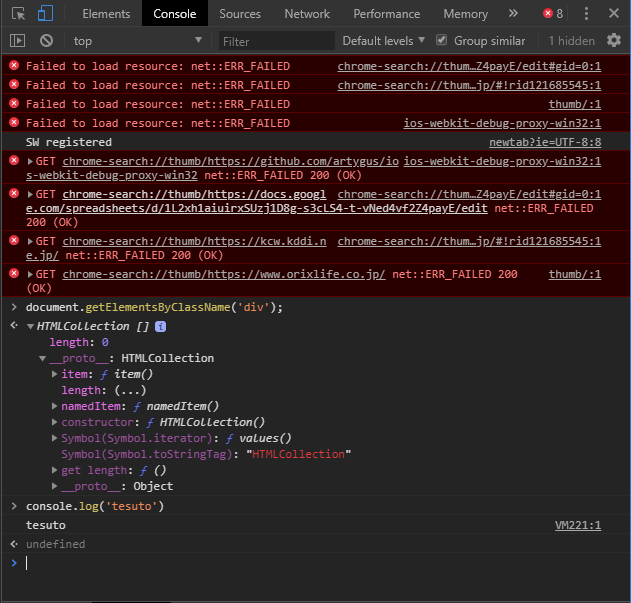
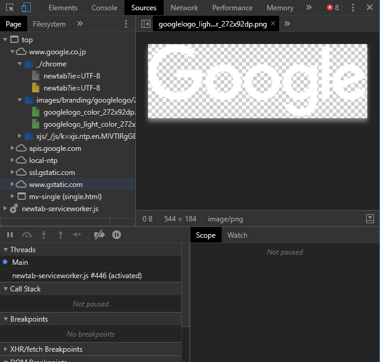
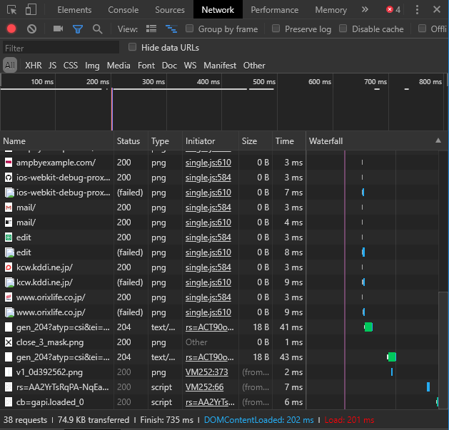
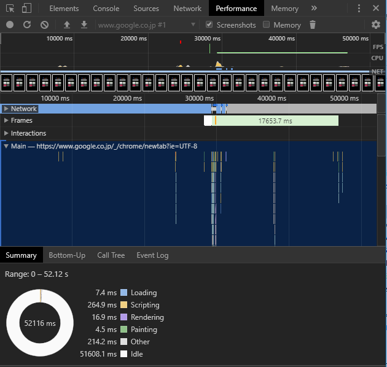
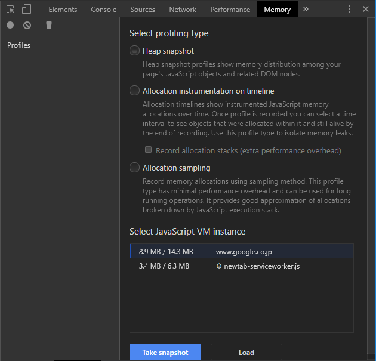
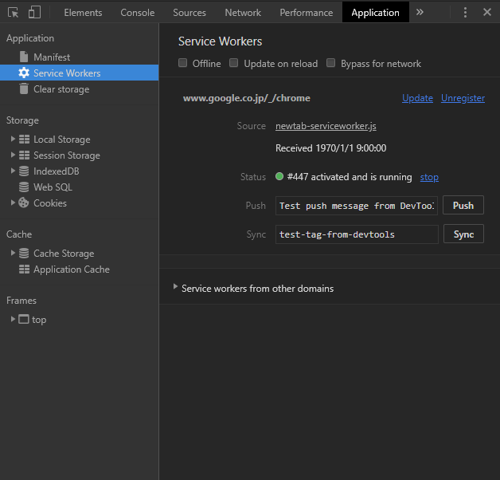
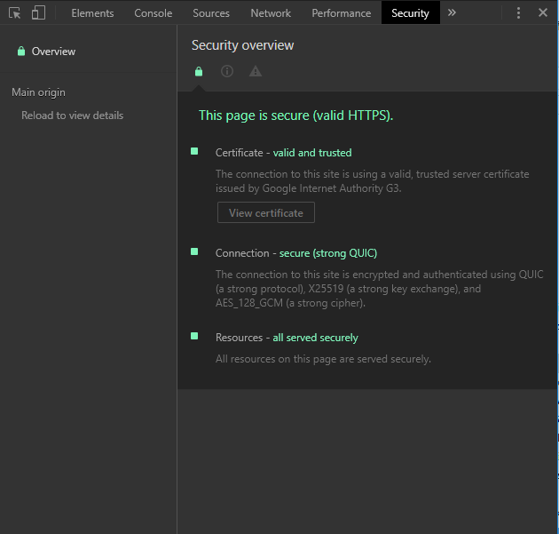
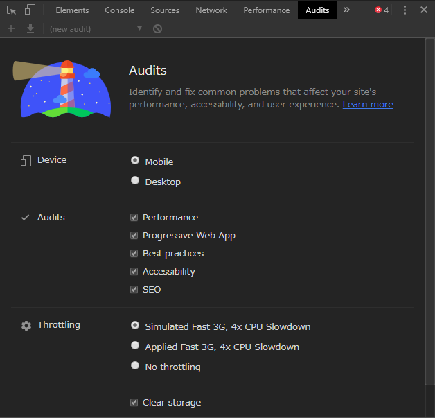

# devツール指南書
フロントエンド開発やWeb全般の業務で必ず使うことになるdevツール。  
今まで触ってこなかった機能もあるので、ここで改めて、こいつが持っている機能をざっと洗い出す。  
  
今回はChromiumベースのChromeを前提とする。
- Winのキーバインド：`Shift` + `Ctrl` + `I`
- Macのキーバインド：`Command` + `Option` + `I`

## ツール一覧
### Elements

### Console

### Sources

### Network

### Performance

### Memory

### Application

### Security

### Audits

### Animations
### Changes
### Coverage
### JavaScipt Profiler
### Layers
### Network conditions
### Performance monitor
### Quick source
### Remote devices
### Rendering
### Request blocking
### Search
### Sensors
### What's New

## その他の便利機能
### 
### 
### 
### 
### 
### 
### 
### 
### 
### 